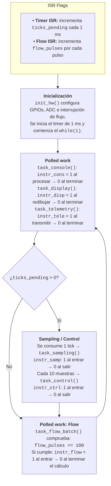

# RET — Timing Evidence Report

**Team:** Juan Felipe Pachon Restrepo · **Boards:** Aun por decidir (ESP 32 C6 O S3) · **Living** document: updated
every week; handed in at the workshop (week 8) and at the close (week 16).
House rule: *"show me the trace"* — every timing claim cites a measurement.

## 1. The system and its task set

Requirements first — one sentence each, EARS style (*when/while <condition>, the
system shall <response> within <deadline>*) — then the task that implements them:

| ID | Requirement |
|---|---|
| REQ-CTRL-01 | While the system is irrigating, the control loop shall run every 10 ms (deadline = period). |
| REQ-CTRL-02 | When pressure exceeds the overpressure threshold, the system shall close the valve within 5 ms. |
| REQ-SAMP-01 | While the system is operating, the sampling task shall execute every 1 ms with jitter bounded within <X> µs. |
| REQ-CONS-01 | When a console command is received, the system shall respond within <Y> ms or discard it as stale. |
| REQ-TEL-01 | While the system is irrigating, the telemetry task shall transmit a CSV line every 1000 ms. |
| REQ-FLOW-01 | While flow pulses accumulate, the system shall compute the flow batch every 100 pulses without blocking the sampling task. |

| Task | Req. | Type (H/F/S) | Period | Deadline | Measured C_i | How it was measured |
|---|---|---|---|---|---|---|
| Control loop | REQ-CTRL-01 | Hard | 10 ms | = T | ____ | <GPIO + analyzer / trace> |
| Overpressure e-stop | REQ-CTRL-02 | Hard | aperiodic | 5 ms | ____ | <GPIO + analyzer / trace> |
| Sampling | REQ-SAMP-01 | Hard | 1 ms | = T | ____ | <GPIO + analyzer / trace> |
| Console | REQ-CONS-01 | Firm | aperiodic | ____ | ____ | <GPIO + analyzer / trace> |
| Telemetry | REQ-TEL-01 | Soft | 1000 ms | = T | ____ | <GPIO + analyzer / trace> |
| Flow batch | REQ-FLOW-01 | — | ~100 ms | ____ | ____ | <GPIO + analyzer / trace> |

## 2. ADRs

### ADR-001 — <title>
**Context:** … · **Decision:** … · **Justification (with numbers):** … · **Status:** …

## 3. Evidence by week

Each entry cites the `REQ`(s) it verifies.

### Week 2 — superloop baseline (C0116-DK)

#### Diagrama de flujo (Task A)



#### Resumen de mediciones del superloop

| Medición | Mi valor | Referencia |
| :--- | :---: | :--- |
| **Período real de muestreo (nominal 1 kHz): promedio** | $996.03\ \mu\text{s}$ | $1000\ \mu\text{s}$ |
| **Jitter de muestreo: máximo durante $\ge 30$ s** | $22578\ \mu\text{s}$ | Registrar el valor obtenido; es la referencia del curso |
| **Latencia ISR $\rightarrow$ atención del superloop (pulso de flujo)** | $14.5\ \mu\text{s}$ | Valor medido en el analizador lógico |
| **Jitter de muestreo máximo con la caché de Flash desactivada** | $24239\ \mu\text{s}$ | La diferencia respecto al jitter base corresponde al acelerador ART |
| **Jitter de muestreo con el comando bloqueante activo** | $437588\ \mu\text{s}$ | Comparar con el jitter base |
| **`backlog_peak`, en reposo $\rightarrow$ durante el comando bloqueante** | $30 \rightarrow 440$ ticks | Misma situación, medida por el firmware |

*   **Fórmulas usadas:**
    *   $\text{Jitter máximo} = \text{Max} - \text{nominal } (1000\ \mu\text{s})$
    *   $\text{Latencia ISR} = \Delta t \text{ entre flancos de CH0 y CH4 (marcador de tiempo)}$
    *   $\text{Consistencia firmware/analizador} \approx \texttt{backlog\_peak} \times 1\text{ ms}$

---

#### Captura base: cache ON (Task B)

<p align="center">
  
  
  <br>
  <em>Figura 1: Capturas del analizador lógico: ventana completa de 30 s, CH0 (<code>instr_samp</code>), caché activa.</em>
</p>

##### Estadísticas de periodo del canal CH0 (`instr_samp`), captura de 30 s

| Parámetro | Valor | Parámetro | Valor |
| :--- | :--- | :--- | :--- |
| $\Delta T$ | $30.087168\text{ s}$ | $N_{\text{falling}}$ | $30198$ |
| $N_{\text{rising}}$ | $30198$ | $f_{\text{min}}$ | $42.413\text{ Hz}$ |
| $f_{\text{max}}$ | $61776.062\text{ Hz}$ | $f_{\text{mean}}$ | $1003.981\text{ Hz}$ |
| $T_{\text{std}}$ | $1.0454\text{ ms}$ | Min | $16.19\ \mu\text{s}$ |
| **Mean** | **$996.03\ \mu\text{s}$** | Freq | $1003.981\text{ Hz}$ |
| SDev | $1045.42\ \mu\text{s}$ | **Max** | **$23577.75\ \mu\text{s}$** |
| Count | $30197$ | | |


*Figura 2: Marcador de tiempo entre CH0 y CH4: $\Delta t = 14.5\ \mu\text{s}$ (latencia ISR $\rightarrow$ atención del superloop).*

---

#### Rebuild cache OFF (Task B)

<p align="center">
  
  
  <br>
  <em>Figura 3: Capturas del analizador lógico: ventana completa de 30 s, CH0 (<code>instr_samp</code>), caché desactivada.</em>
</p>

##### Estadísticas de periodo del canal CH0 (`instr_samp`), captura de 30 s, caché desactivada

| Parámetro | Valor | Parámetro | Valor |
| :--- | :--- | :--- | :--- |
| $\Delta T$ | $30.108416\text{ s}$ | $N_{\text{falling}}$ | $30220$ |
| $N_{\text{rising}}$ | $30220$ | $f_{\text{min}}$ | $39.621\text{ Hz}$ |
| $f_{\text{max}}$ | $42553.191\text{ Hz}$ | $f_{\text{mean}}$ | $1003.706\text{ Hz}$ |
| $T_{\text{std}}$ | $1.1157\text{ ms}$ | Min | $23.50\ \mu\text{s}$ |
| **Mean** | **$996.31\ \mu\text{s}$** | Freq | $1003.706\text{ Hz}$ |
| SDev | $1115.66\ \mu\text{s}$ | **Max** | **$25239.44\ \mu\text{s}$** |
| Count | $30219$ | | |

---

#### calib activo (Task C)


*Figura 4: Captura del analizador lógico durante el disparo de `calib`, CH0 (`instr_samp`).*

```text
t=23000 ... backlog=30
calib
calibrating zero-flow offset (1000 rounds)...
calibration done
t=25000 ... backlog=440
...
status
p=1489 mV sp=1500 mV duty=45% flow_x100=0 estop=0
batches=0 backlog_peak=440
```

##### Estadísticas de periodo del canal CH0 (`instr_samp`), captura con `calib` activo

| Parámetro | Valor | Parámetro | Valor |
| :--- | :--- | :--- | :--- |
| $\Delta T$ | $20.015616\text{ s}$ | $N_{\text{falling}}$ | $20088$ |
| $N_{\text{rising}}$ | $20088$ | $f_{\text{min}}$ | $2.280\text{ Hz}$ |
| $f_{\text{max}}$ | $42553.191\text{ Hz}$ | $f_{\text{mean}}$ | $1003.635\text{ Hz}$ |
| $T_{\text{std}}$ | $3.2828\text{ ms}$ | Min | $23.50\ \mu\text{s}$ |
| **Mean** | **$996.38\ \mu\text{s}$** | Freq | $1003.635\text{ Hz}$ |
| SDev | $3282.80\ \mu\text{s}$ | **Max** | **$438588.31\ \mu\text{s}$** |
| Count | $20087$ | | |

Al ejecutar `calib`, `task_console()` bloquea el superloop dentro de `cmd_calib()` ($\approx 1000 \text{ rondas} \times 400\ \mu\text{s}$ de `k_busy_wait`), impidiendo que se drene `ticks_pending`: el backlog salta de $30$ a $440$ ticks y el jitter de `instr_samp` pasa de $\approx 22.6\text{ ms}$ a $\approx 437.6\text{ ms}$, consistente entre analizador y firmware.

---

### Week 3 — S3 baseline and silicon comparison
…

## 4. Schedulability analysis

U = ΣC_i/T_i with **measured** C_i; test used (RM / hyperbolic / EDF); RTA as a
script with its output; blocking B_i if there are mutexes. (Formulas: READINGS.md,
"The math that does get used".)

## 5. Functional safety (final project)

Declared safe state (failure ⇒ valve closed), watchdog, and the evidence of the
fail-safe firing.
