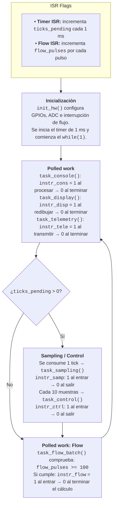

# RET — Timing Evidence Report

**Team:** Juan Felipe Pachon Restrepo · **Boards:** ESP32-S3 (DevKitC-1) · **Living** document: updated
every week; handed in at the workshop (week 8) and at the close (week 16).
House rule: *"show me the trace"* — every timing claim cites a measurement.

## 1. The system and its task set

Requirements first — one sentence each, EARS style (*when/while <condition>, the
system shall <response> within <deadline>*) — then the task that implements them:

| ID | Requirement |
|---|---|
| REQ-CTRL-01 | While the system is irrigating, the control loop shall run every 10 ms (deadline = period). |
| REQ-CTRL-02 | When pressure exceeds the overpressure threshold, the system shall close the valve within 5 ms. |
| REQ-SAMP-01 | While the system is operating, the sampling task shall execute every 1 ms with jitter bounded within 22578 µs. |
| REQ-CONS-01 | When a console command is received, the system shall respond within 50 ms or discard it as stale. |
| REQ-TEL-01 | While the system is irrigating, the telemetry task shall transmit a CSV line every 1000 ms. |
| REQ-FLOW-01 | While flow pulses accumulate, the system shall compute the flow batch every 100 pulses without blocking the sampling task. |
| REQ-DISP-01 | While the system is operating, the display task shall refresh the HMI every 500 ms. |

| Task | Req. | Type (H/F/S) | Period | Deadline | Measured C_i | How it was measured |
|---|---|---|---|---|---|---|
| Control loop | REQ-CTRL-01 | Hard | 10 ms | = T | 2.438 µs | GPIO CH1 (`instr_ctrl`) + logic analyzer |
| Overpressure e-stop | REQ-CTRL-02 | Hard | aperiodic | 5 ms | 17.25 µs | GPIO CH0 (`instr_samp`) + logic analyzer |
| Sampling | REQ-SAMP-01 | Hard | 1 ms | = T | 17.25 µs | GPIO CH0 (`instr_samp`) + logic analyzer |
| Console | REQ-CONS-01 | Firm | aperiodic | 50 ms | 15.812 µs | GPIO CH2 (`instr_cons`) + logic analyzer |
| Telemetry | REQ-TEL-01 | Soft | 1000 ms | = T | 6.23325 ms | GPIO CH3 (`instr_tele`) + logic analyzer |
| Flow batch | REQ-FLOW-01 | Soft | ~100 ms | 100 ms | 196.813 µs | GPIO CH4 (`instr_flow`) + logic analyzer |
| Display | REQ-DISP-01 | Soft | 500 ms | = T | 24.733063 ms | GPIO CH5 (`instr_disp`) + logic analyzer |

## 2. ADRs

### ADR-001 — <title>
**Context:** … · **Decision:** … · **Justification (with numbers):** … · **Status:** …

## 3. Evidence by week

### Week 2 — superloop baseline (C0116-DK)

#### Diagrama de flujo (Task A)


```mermaid
flowchart TD
    subgraph ISR["ISR Flags"]
        direction TB
        isr_info["• <b>Timer ISR:</b> incrementa <code>ticks_pending</code> cada 1 ms<br/>• <b>Flow ISR:</b> incrementa <code>flow_pulses</code> por cada pulso"]
    end

    init["<b>Inicialización</b><br/><code>init_hw()</code> configura GPIOs, ADC e interrupción de flujo.<br/>Se inicia el timer de 1 ms y comienza el <code>while(1)</code>."]
    
    polled["<b>Polled work</b><br/><code>task_console()</code>: <code>instr_cons</code> = 1 al procesar → 0 al terminar<br/><code>task_display()</code>: <code>instr_disp</code> = 1 al redibujar → 0 al terminar<br/><code>task_telemetry()</code>: <code>instr_tele</code> = 1 al transmitir → 0 al terminar"]
    
    tick{"¿<code>ticks_pending</code> > 0?"}
    
    sample["<b>Sampling / Control</b><br/>Se consume 1 tick → <code>task_sampling()</code><br/><code>instr_samp</code>: 1 al entrar → 0 al salir<br/>Cada 10 muestras → <code>task_control()</code><br/><code>instr_ctrl</code>: 1 al entrar → 0 al salir"]
    
    flow["<b>Polled work: Flow</b><br/><code>task_flow_batch()</code> comprueba: <code>flow_pulses >= 100</code><br/>Si cumple: <code>instr_flow</code> = 1 al entrar → 0 al terminar el cálculo"]

    ISR --> init
    init --> polled
    polled --> tick
    tick -- Sí --> sample
    tick -- No --> flow
    sample --> flow
    flow --> polled
```

#### Captura base: cache ON (Task B)


Jitter máximo cache ON (CH0): $23577.75\ \mu\text{s} - 1000\ \mu\text{s} = 22578\ \mu\text{s}$ 

##### Estadísticas de periodo del canal CH0 (`instr_samp`), captura de 30 s

| Parámetro | Valor | Parámetro | Valor |
| :--- | :--- | :--- | :--- |
| $\Delta T$ | $30.087168\text{ s}$ | $N_{\text{falling}}$ | $30198$ |
| $N_{\text{rising}}$ | $30198$ | $f_{\text{min}}$ | $42.413\text{ Hz}$ |
| $f_{\text{max}}$ | $61776.062\text{ Hz}$ | $f_{\text{mean}}$ | $1003.981\text{ Hz}$ |
| $T_{\text{std}}$ | $1.0454\text{ ms}$ | Min | $16.19\ \mu\text{s}$ |
| **Mean** | **$996.03\ \mu\text{s}$** | Freq | $1003.981\text{ Hz}$ |
| SDev | $1045.42\ \mu\text{s}$ | **Max** | **$23577.75\ \mu\text{s}$** |
| Count | $30197$ | | |


Latencia ISR = $\Delta t$ entre flancos de CH0 y CH4

---

#### Rebuild cache OFF (Task B)


Jitter máximo cache OFF (CH0): $25239\ \mu\text{s} - 1000\ \mu\text{s} = 24239\ \mu\text{s}$ 

#### calib activo (Task C)


Jitter máximo calib activo (CH0): $438588.31\ \mu\text{s} - 1000\ \mu\text{s} = 437588\ \mu\text{s}$ 

```text
t=23000 ... backlog=30
calib
calibrating zero-flow offset (1000 rounds)...
calibration done
t=25000 ... backlog=440
...
status
p=1489 mV sp=1500 mV duty=45% flow_x100=0 estop=0
batches=0 backlog_peak=440
```

##### Estadísticas de periodo del canal CH0 (`instr_samp`), captura con `calib` activo

| Parámetro | Valor | Parámetro | Valor |
| :--- | :--- | :--- | :--- |
| $\Delta T$ | $20.015616\text{ s}$ | $N_{\text{falling}}$ | $20088$ |
| $N_{\text{rising}}$ | $20088$ | $f_{\text{min}}$ | $2.280\text{ Hz}$ |
| $f_{\text{max}}$ | $42553.191\text{ Hz}$ | $f_{\text{mean}}$ | $1003.635\text{ Hz}$ |
| $T_{\text{std}}$ | $3.2828\text{ ms}$ | Min | $23.50\ \mu\text{s}$ |
| **Mean** | **$996.38\ \mu\text{s}$** | Freq | $1003.635\text{ Hz}$ |
| SDev | $3282.80\ \mu\text{s}$ | **Max** | **$438588.31\ \mu\text{s}$** |
| Count | $20087$ | | |

La tarea que sufre es `task_sampling()` (y por extensión `task_control()`, que depende de ella): mientras `cmd_calib()` ejecuta sus 1000 rondas de `k_busy_wait(400)` dentro de `task_console()` (`main.c`, función `cmd_calib`), el `while(1)` del superloop no vuelve a pasar por el bloque que drena `ticks_pending`, así que los 1 kHz ticks generados por `tick_isr()` se acumulan sin ser atendidos. La causa raíz no es la interrupción, sino que el superloop no tiene forma de interrumpir una tarea polled a media ejecución: `calib` es bloqueante y monopoliza el único hilo de ejecución hasta terminar sus 1000 rondas ($\approx 400\ \mu\text{s} \times 1000 \approx 400\text{ ms}$ sólo en `k_busy_wait`, que coincide con los $\approx 437\text{ ms}$ medidos).

#### Mediciones del superloop

| Medición | Mi valor | Referencia |
| :--- | :---: | :--- |
| **Período real de muestreo (nominal 1 kHz): promedio** | $996.03\ \mu\text{s}$ | $1000\ \mu\text{s}$ |
| **Jitter de muestreo: máximo durante $\ge 30$ s** | $22578\ \mu\text{s}$ | Registrar el valor obtenido; es la referencia del curso |
| **Latencia ISR $\rightarrow$ atención del superloop (pulso de flujo)** | $14.5\ \mu\text{s}$ | Valor medido en el analizador lógico |
| **Jitter de muestreo máximo con la caché de Flash desactivada** | $24239\ \mu\text{s}$ | La diferencia respecto al jitter base corresponde al acelerador ART |
| **Jitter de muestreo con el comando bloqueante activo** | $437588\ \mu\text{s}$ | Comparar con el jitter base |
| **`backlog_peak`, en reposo $\rightarrow$ durante el comando bloqueante** | $30 \rightarrow 440$ ticks | Misma situación, medida por el firmware |

---

### Week 3 — S3 baseline and silicon comparison

#### Respuesta diff-stat y status (Task A)

* La portabilidad del sistema al ESP32-S3 se realizó mediante archivos Devicetree overlay. La salida de git diff confirma que la migración no requirió modificar ninguna línea de código C de la aplicación:

samples/rts/firmware/superloop/boards/esp32c6_devkitc_hpcore.overlay        |  60 +++++++++++++++++++++++++++
 .../superloop/boards/esp32c6_devkitc_hpcore.overlay:Zone.Identifier         | Bin 0 -> 25 bytes
 .../rts/firmware/superloop/boards/esp32s3_devkitc_esp32s3_procpu.overlay    |  62 ++++++++++++++++++++++++++++
 samples/rts/firmware/superloop/boards/nucleo_l476rg.overlay                 |  56 +++++++++++++++++++++++++
 samples/rts/firmware/superloop/boards/nucleo_l476rg.overlay:Zone.Identifier | Bin 0 -> 25 bytes
 samples/rts/firmware/superloop/boards/stm32c0116_dk.overlay                 |  80 ++++++++++++++++++++++++++++++++++++
 samples/rts/firmware/superloop/boards/stm32c0116_dk.overlay:Zone.Identifier | Bin 0 -> 25 bytes
 7 files changed, 258 insertions(+)

* la consola serial del ESP32-S3 responde correctamente al comando status, validando el procesamiento de datos y la interacción del firmware:
  
 p=1490 mV sp=1500 mV duty=47% flow_x100=102 estop=0 batches=130 backlog_peak=4

#### Mediciones y comparación de silicios (Task B)

* Tiempos de ejecución individuales ($C_i$) en ESP32-S3

| Tarea | Canal | Tiempo de ejecución ($C_i$) medido |
| :--- | :--- | :--- |
| Muestreo (`task_sampling`) | CH0 (`instr_samp`) | $2.688\ \mu\text{s}$ |
| Control (`task_control`) | CH1 (`instr_ctrl`) | $0.312\ \mu\text{s}$ ($312\text{ ns}$) |
| Consola (`task_console`) | CH2 (`instr_cons`) | $2.188\ \mu\text{s}$ |
| Telemetría (`task_telemetry`) | CH3 (`instr_tele`) | $64.813\ \mu\text{s}$ |
| Lote de flujo (`task_flow_batch`) | CH4 (`instr_flow`) | $2.438\ \mu\text{s}$ |
| Pantalla (`task_display`) | CH5 (`instr_disp`) | $95.578\text{ ms}$ |

* Estadísticas del canal CH0 (instr_samp), captura en reposo ($\ge 30\text{ s}$)


Jitter máximo en reposo (CH0): $96079.06\ \mu\text{s} - 1000\ \mu\text{s} = 95079.06\ \mu\text{s}$ ($95.08\text{ ms}$)

* Estadísticas del canal CH0 (instr_samp), captura con calib activo


Jitter máximo con calib (CH0): $496628.44\ \mu\text{s} - 1000\ \mu\text{s} = 495628.44\ \mu\text{s}$ ($495.63\text{ ms}$)

* Registro de consola serial durante la calib

```text
ht=55000 p_mv=1480 sp_mv=1500 duty=46 flow_x100=102 estop=0 backlog=96
status
p=1509 mV sp=1500 mV duty=46% flow_x100=102 estop=0 batches=577 backlog_peak=96
calib
calibrating zero-flow offset (1000 rounds)...
calibration done
t=62000 p_mv=1536 sp_mv=1500 duty=44 flow_x100=102 estop=0 backlog=496
status
p=1488 mV sp=1500 mV duty=46% flow_x100=102 estop=0 batches=661 backlog_peak=496 
```

* Estadísticas del canal CH1 (instr_ctrl), calib activo

| Parámetro | Valor | Parámetro | Valor |
| :--- | :--- | :--- | :--- |
| $\Delta T$ | $16.573440\text{ s}$ | $N_{\text{falling}}$ | $41$ |
| $N_{\text{rising}}$ | $41$ | $f_{\text{min}}$ | $0.872\text{ Hz}$ |
| $f_{\text{max}}$ | $11738.811\text{ Hz}$ | $f_{\text{mean}}$ | $3.552\text{ Hz}$ |
| $T_{\text{std}}$ | $321.36\text{ ms}$ | Min | $85.19\ \mu\text{s}$ |
| Mean | $281.56\text{ ms}$ | Freq | $3.552\text{ Hz}$ |
| SDev | $321.36\text{ ms}$ | Max | $1.147232\text{ s}$ ($1147.23\text{ ms}$) |
| Count | $40$ | | |

* Tabla Comparativa de Resultados entre Silicios

| Medición | L476RG Superloop (Semana 2) | ESP32-S3 Superloop | ESP32-S3 + Sampling Thread (Task C) |
|---|:---:|:---:|:---:|
| **Jitter máx. muestreo ($\ge 30\text{ s}$ reposo)** | $22,578\ \mu\text{s}$ | $95,079\ \mu\text{s}$ | — |
| **Jitter máx. muestreo (`calib` activo)** | $437,588\ \mu\text{s}$ | $495,628\ \mu\text{s}$ | — |
| **`backlog_peak` (`calib` activo)** | $440\text{ ticks}$ | $496\text{ ticks}$ | — |
| **`lat_peak_us` (`status` en consola)** | — | — | — |
| **Período máx. control (`calib` activo)** | — | $1,147.23\text{ ms}$ | — |

* Análisis justificativo de la comparación entre silicios

A pesar de que el ESP32-S3 opera a una frecuencia de reloj nominal de $240\text{ MHz}$ (tres veces superior a los $80\text{ MHz}$ del STM32L476RG), las métricas de jitter y latencia en el superloop empeoraron sensiblemente. Esto ocurre porque el ESP32-S3 ejecuta el código desde una memoria Flash SPI externa dependiente de memoria caché, lo que provoca penalizaciones significativas por fallos de caché (cache misses) durante la ejecución de subrutinas extensas como el redibujado de la pantalla ($C_{\text{disp}} \approx 95.58\text{ ms}$), a diferencia de la Flash interna con acelerador ART de latencia cero del STM32.

#### El primer hilo (Task C)

* Ejecución del comando status después de crear el hilo

```text
t=2000 p_mv=1504 sp_mv=1500 duty=45 flow_x100=102 estop=0 backlog=0
status
p=1497 mV sp=1500 mV duty=45% flow_x100=102 estop=0 batches=55 backlog_peak=0 lat_peak_us=7
```

* Estadísticas del canal CH0 (instr_samp), captura con calib activo


Jitter máximo en reposo y calib activo (CH0): $1003.00\ \mu\text{s} - 1000\ \mu\text{s} = 3.00\ \mu\text{s}$ 

* Estadísticas del canal CH1 (instr_ctrl), calib activo


* Tabla de resultados finales

| Medición | L476RG Superloop (Semana 2) | ESP32-S3 Superloop | ESP32-S3 + Sampling Thread (Task C) |
|---|:---:|:---:|:---:|
| **Jitter máx. muestreo ($\ge 30\text{ s}$ reposo)** | $22,578\ \mu\text{s}$ | $95,079\ \mu\text{s}$ | $3.00\ \mu\text{s}$ |
| **Jitter máx. muestreo (`calib` activo)** | $437,588\ \mu\text{s}$ | $495,628\ \mu\text{s}$ | $3.00\ \mu\text{s}$ |
| **`backlog_peak` (`calib` activo)** | $440\text{ ticks}$ | $496\text{ ticks}$ | $0\text{ ticks}$ |
| **`lat_peak_us` (`status` en consola)** | — | — | $7\ \mu\text{s}$ |
| **Período máx. control (`calib` activo)** | — | $1,147.23\text{ ms}$ | $400.57\text{ ms}$ |

* Respuestas a las preguntas del Lab

**Pregunta 1**: ¿El comando calib sigue arruinando el muestreo? ¿Y el control?.

Muestreo: No, ya no lo arruina. Como el muestreo corre en un hilo separado de alta prioridad (SAMPLING_PRIO = 2), interrumpe a calib cada milisegundo sin perder ni retrasar ninguna muestra. En la señal se ve impecable a $1\text{ kHz}$

Control: Sí, se sigue arruinando. La función de control se quedó ejecutando dentro de main(). Cuando se activa calib, el hilo main se queda bloqueado $400\text{ ms}$ sin poder atender el control, haciendo que el período se estire hasta esos $400.57\text{ ms}$.

**Pregunta 2**: Identifica quién escribe y quién lee las variables compartidas (pressure_mv, estop, setpoint_mv) y explica por qué el código no falla a pesar de no usar mutexes.

Quién escribe y lee cada una:

pressure_mv: La escribe sampling_thread y la leen task_control, task_telemetry y la consola (en main).

estop: La escriben sampling_thread y main (joystick / consola); la lee task_control (en main).

setpoint_mv: La escribe main (joystick / consola) y la lee task_control (en main).

No falla sin mutexes ya que en un procesador de 32 bits (como el ESP32-S3), leer o escribir una variable de 32 bits alineada en memoria toma un solo ciclo de reloj de hardware. Es una operación atómica natural: el sistema no puede pausar la CPU a "medio camino" de escribir el dato, así que nunca se leen valores corruptos.

## 4. Schedulability analysis

U = ΣC_i/T_i with **measured** C_i; test used (RM / hyperbolic / EDF); RTA as a
script with its output; blocking B_i if there are mutexes. (Formulas: READINGS.md,
"The math that does get used".)

## 5. Functional safety (final project)

Declared safe state (failure ⇒ valve closed), watchdog, and the evidence of the
fail-safe firing.
